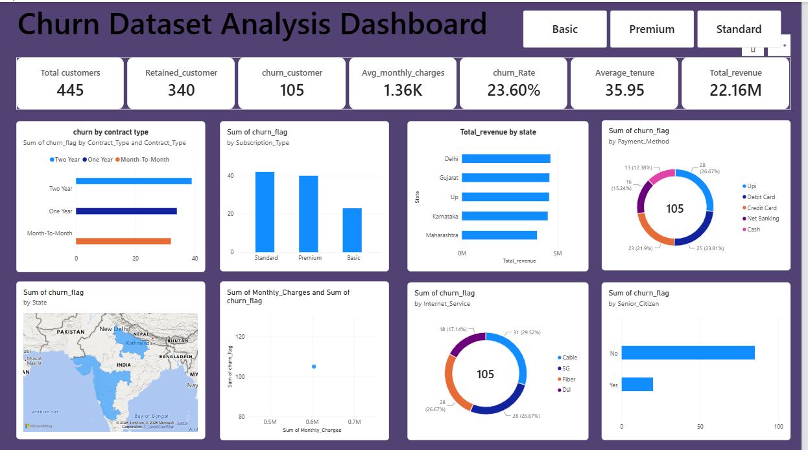

# 📊 Customer Churn Analysis & Analytics Dashboard

An end-to-end **Customer Churn Analysis** project built using Python, Pandas, MySQL, SQL, and Power BI.

The project focuses on cleaning and transforming raw customer data, performing SQL-based analysis, and building an interactive Power BI dashboard to understand customer churn, revenue, customer behavior, and key business metrics.

---

## 📸 Dashboard Preview



---

## 🎯 Project Objective

The main objective of this project is to analyze customer churn and identify important patterns related to:

- Customer retention and churn
- Contract and subscription types
- Revenue across states
- Internet service usage
- Payment methods
- Customer tenure
- Senior citizen churn
- Customer value
- Monthly charges

The analysis transforms raw and unclean customer data into meaningful business insights.

---

## 🔄 Project Workflow

```text
Excel
  ↓
Raw / Unclean Customer Data
  ↓
Python + Pandas
  ↓
Data Cleaning
  ↓
Feature Engineering
  ↓
Clean Dataset
  ↓
MySQL Database
  ↓
SQL Analysis
  ↓
Power BI
  ↓
Interactive Dashboard
